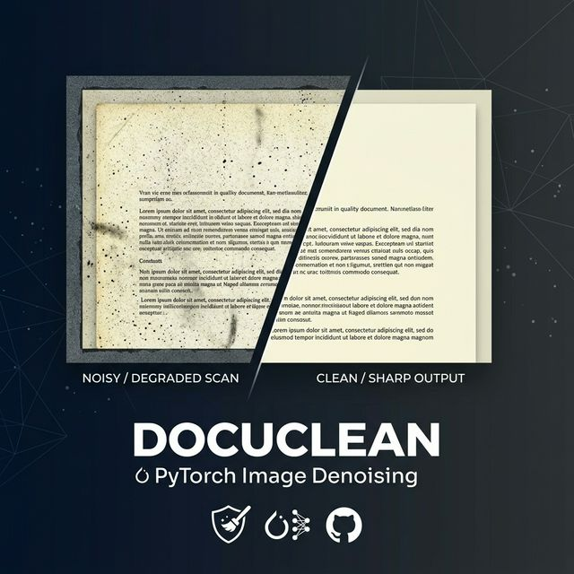

<div align="center">
  

  # 🧼 DocuClean
  **PyTorch-based Denoising Autoencoder for Grayscale Document Scans**

  [](https://www.python.org/downloads/)
  [](https://pytorch.org/)
  [](https://streamlit.io/)
  [](https://opensource.org/licenses/MIT)
</div>

<br/>

DocuClean is a performant **Image Denoising Pipeline** tailored specially for grayscale document scans such as IDs, licenses, and certificates. Using a U-Net inspired Autoencoder with skip connections and residual blocks, it restores sharp clarity to degraded images, significantly improving OCR accuracy and ensuring crisp, legible outputs.

The project includes an interactive **Streamlit UI** for quick visual demos and well-structured CLI scripts for experimentation, training, and testing.

---

## ✨ Key Features

- **Document-First Tuning**: Optimised specifically for text-heavy scans with fine edges, background noise, and subtle gradients.
- **Advanced Architecture**: U-Net based Autoencoder utilizing Residual Blocks in the bottleneck and an aggressive combined loss function.
- **Streamlit Demo App**: A beautifully styled, bento-inspired Streamlit web application. Upload a noisy image and visually inspect the denoised output instantly.
- **GPU-Aware**: Scripts fall back to CPU gracefully but fully leverage CUDA acceleration when available.

---

## 🏗️ Project Architecture

```text
.
├── streamlit_app.py           # Streamlit demo UI (Inference)
├── train_denoising_model.py   # Main training script with Combined Loss
├── test_model.py              # CLI Inference/testing helper
├── Denoise2.py                # Specialized evaluation and plotting
├── prepare_clean_dataset.py   # Dataset prep helper (clean images)
├── prepare_noisy_dataset.py   # Dataset prep helper (noisy images)
├── models/                    # Stores trained checkpoint outputs (*.pth)
├── assets/                    # Assets and visualizations
├── requirements.txt           # Python dependencies
├── README.md                  # Detailed Project description
└── TESTING_GUIDE.md           # Instructions on specific tests
```

---

## 🚀 Getting Started

### 1. Setup Environment

We recommend creating a virtual environment for the dependencies.

```bash
# Clone or navigate to the repository
cd /mnt/NewDisk/sahil_project/Image-Denoising-Autoencoder-main

# Initialize a Virtual Environment
python3 -m venv .venv
source .venv/bin/activate

# Install requirements
pip install -r requirements.txt
```

### 2. Run the Streamlit Demo

Want to see it in action instantly?
Make sure you have a trained PyTorch model inside your `models/` directory (by default, `best_denoising_model.pth`).

```bash
source .venv/bin/activate
streamlit run streamlit_app.py --server.port 3001
```

1. Navigate to **http://localhost:3001** in your browser.
2. Upload a noisy document scan (`.png`, `.jpg`).
3. Download the natively restored clean file.

---

## 🧠 Model Training

You can easily adapt the model to new textual noise distribution scenarios using your own paired dataset. Place large datasets inside `noisy_dataset/` and `clean_dataset/` respectively (ignored by git by default).

```bash
source .venv/bin/activate
python train_denoising_model.py
```

The script monitors Validation Loss using `ReduceLROnPlateau` and writes out `best_denoising_model.pth` aggressively during execution using Gradient Clipping to ensure high stability. 

### Performance Tracking
During training, the script outputs training metrics charts directly. See `assets/training_loss_suffix.png` for a visualization of convergence.

---

## 🧪 CLI Inference & Testing

Test your saved checkpoints programmatically via Terminal.

**Test a single image:**
```bash
source .venv/bin/activate
python test_model.py \
  --model models/best_denoising_model.pth \
  --input path/to/noisy.png \
  --output outputs/denoised.png \
  --show
```
*Tip: Include `--clean path/to/clean.png` to calculate comparison metrics alongside visual inference.*

**Test an entire directory:**
```bash
python test_model.py \
  --model models/best_denoising_model.pth \
  --input noisy_dataset/TE \
  --output outputs/ \
  --clean clean_dataset/TE
```

---

## ⚖️ License
Distributed under the MIT License. See `LICENSE` for more information.